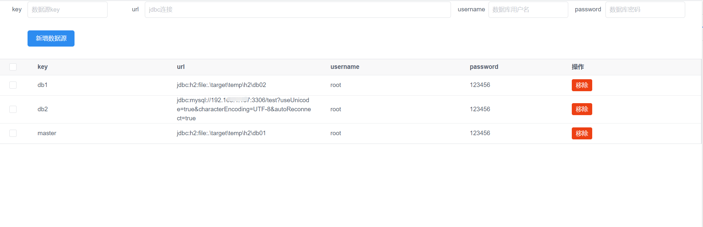

- [简介](#简介)
    - [什么是动态数据源](#什么是动态数据源)
    - [支持功能](#支持功能)
    - [动态多数据源可以怎么玩](#动态多数据源可以怎么玩)
    - [使用注意](#使用注意)
- [快速开始](#快速开始)
    - [1.引入依赖](#1引入依赖)
    - [2.配置多数据源](#2配置多数据源)
    - [3.使用动态数据源](#3使用动态数据源)
        - [3.1使用注解指定数据源](#31使用注解指定数据源)
        - [3.2使用注解不指定数据源](#32使用注解不指定数据源)
        - [3.3根据请求方法参数切换](#33根据请求方法参数切换)
- [动态数据源事务](#动态数据源事务)
    - [1.使用检查](#1使用检查)
    - [2.方法标记事务注解@DynamicTransactional](#2方法标记事务注解dynamictransactional)
    - [3.注意事项](#3注意事项)
- [连接池支持](#连接池支持)
    - [1.druid集成](#1druid集成)
        - [1.1配置示例--基础](#11配置示例--基础)
        - [1.2配置示例--个性化](#12配置示例--个性化)
    - [2.其他数据源(需求需求收集中)](#2其他数据源需求需求收集中)
- [动态数据源管理](#动态数据源管理)
    - [1.api调用方式](#1api调用方式)
    - [2.内置web管理](#2内置web管理)
        - [2.1web管理身份认证](#21web管理身份认证)


# 简介
## 什么是动态数据源
> 使用spring切面及数据源路由等技术实现的应用端数据源切换框架,实现接口根据请求头/请求参数/方法注解快速切换功能

## 支持功能
1. 支持项目配置多数据源
2. 支持根据注解/请求参数(spel表达式)/请求头(支持自定义),切换数据源
3. 支持嵌套切换数据源
4. 支持动态数据源本地事务(事务嵌套目前只支持PROPAGATION_REQUIRED)外层有事务，当前事务加入到外层事务)
5. 支持动态动态创建及删除数据源等管理, 内嵌web管理页面
6. 支持不同数据源使用不同连接池技术,druid连接池


## 动态多数据源可以怎么玩

1. 业务分库: 不引入其他中间件前提下,低成本业务分库,不同的业务存储在不同的数据库中,如报表系统
2. 主备切换: 使用请求头设置表示,主源故障情况下,切换备用源
3. 联调利器: 服务重启耗时,对接多个环境,不用重启应用就可直接对接不同环境.

## 使用注意
1. 动态数据源切换不能在开启spring事务范围下生效, 开启spring事务mybatis会一直使用进入方法获取的数据源连接。
2. 加载动态数据源使用不同数据库的,需要在项目内引入对应驱动

# 快速开始

## 1.引入依赖
```xml
        <dependency>
            <groupId>io.github.easycode8</groupId>
            <artifactId>dynamic-datasource-spring-boot-starter</artifactId>
            <!-- 具体版本替换左上角最新版本号(数字部分)或者tag -->
            <version>latest</version>
        </dependency>
```

## 2.配置多数据源
引入多数据源starter后,对旧的单数据源无需改动,增加动态数据源配置。动态数据源优先级自动提高
```yaml
spring:
  datasource:
    dynamic:
      enabled: true #是否开启动态数据源,默认true
      transaction:
        enabled: true #是否开启动态数据源事务,默认为true
      header: db-type #是否开启请求头切换,默认为空则不开启,优先级低于注解配置
      primary: master #首选数据源, 未指定数据源情况下使用的数据源,一般设置未主数据源, 默认master
      check: false #是否强制检查数据源有效性,默认false
      strict: true #是否严格匹配数据源,匹配不到报错, 默认true 
      datasource:
        master:
          url: jdbc:oracle:thin:@//127.0.0.1:1521/test
          username: root
          password: 123456
          driver-class-name: oracle.jdbc.OracleDriver
        db1:
          driver-class-name: org.h2.Driver
          url: jdbc:h2:mem:test
          username: root
          password: 123456
        db2:
          driver-class-name: com.mysql.jdbc.Driver
          url: jdbc:mysql://127.0.0.1:3306/test?useUnicode=true&characterEncoding=UTF-8&autoReconnect=true
          username: root
          password: 123456
        #其他数据源...
```
## 3.使用动态数据源
在需要使用不同数据源的方法上增加动态数据源注解@DynamicSource。则表示为该方法开始数据源切换。

目前支持三种切换
- @DynamicSource("数据源标识") 使用标识的数据源执行业务方法
- @DynamicSource 不定义数据源标识,则根据请求头中携带数据源标识
- @DynamicSource("spel表达式 如 #account.name") 指定请求参数中的某个变量的值作为切换标识


### 3.1使用注解指定数据源
示例: 指定方法使用db1定义的数据源执行业务
```java
@Service
public class AccountServiceImpl implements AccountService {
    @Autowired
    private AccountMapper accountMapper;
    
    @DynamicSource("db1")
    public void createAccount(Account account) {
        this.doCreateAccount(account);
    }


}
```
### 3.2使用注解不指定数据源

示例: 方法只定义数据源切换,不定义数据源,则根据运行时请求头标识传递的数据源作为标识


```java
@Service
public class AccountServiceImpl implements AccountService {
    @Autowired
    private AccountMapper accountMapper;

    @DynamicSource
    public void createAccount(Account account) {
        this.doCreateAccount(account);
    }


}
```
http使用的请求头变量,默认为db-type可以自定义
```yaml
spring:
  datasource:
    dynamic:
      header: db-type
```

### 3.3根据请求方法参数切换
支持根据spring spel表达式解析运行时请求参数指定字段,作为数据源切换标识。具体使用
什么参数的什么值,可以根据具体业务选择。

示例: 根据用户归属的租户属性来确定使用对应数据源

```java
@Service
public class AccountServiceImpl implements AccountService {
    @Autowired
    private AccountMapper accountMapper;
    
    // 根据请求方法参数account中的tenant字段切换数据源
    @DynamicSource("#account.tenant")
    public void createAccount(Account account) {
        this.doCreateAccount(account);
    }
    
    
}

```
使用db1数据源
```json
{
	"account": {
		"tenant": "db1",
		"username": "zhangsan"
	}
}
```
使用db1数据源
```json
{
	"account": {
		"tenant": "db2",
		"username": "zhangsan"
	}
}
```

# 动态数据源事务
## 1.使用检查
dynamic-datasource-spring-boot-starter 已经默认事务支持功能,使用事务之前确认事务开关启用
```yaml
spring:
  datasource:
    dynamic:
      enabled: true #是否开启动态数据源,默认true
      transaction:
        enabled: true #是否开启动态数据源事务,默认为true
```

## 2.方法标记事务注解@DynamicTransactional

```java
@Service
public class AccountServiceImpl implements AccountService {
    @Autowired
    private AccountMapper accountMapper;

    @DynamicTransactional
    @DynamicSource("#account.tenant")
    public void createAccount(Account account) {
        this.doCreateAccount(account);
    }
    
    
}
```

## 3.注意事项
- 动态数据源事务与spring原生事务管理应该保持独立. 当外层使用动态数据源事务时,在调用开启spring事务的方法则会报错


# 连接池支持
动态数据源默认使用springboot的默认数据源,支持指定数据源使用连接池方案。只需要引入对用数据源依赖
并,在type指定连接池

## 1.druid集成
- 支持快速druid-spring-boot-starter连接池集成
- 支持数据源独立连接池配置

### 1.1配置示例--基础
1. 引入druid-spring-boot-starter依赖,配置druid原生的配置
2. 在需要使用druid的数据源指定type: com.alibaba.druid.pool.DruidDataSource

```yaml
spring:
  datasource:
    dynamic:
      datasource:
        master:
          driver-class-name: org.h2.Driver
          url: jdbc:h2:mem:test 
          username: root
          password: 123456
          type: com.alibaba.druid.pool.DruidDataSource #指定数据源的连接池类型

    
    druid: #druid-spring-boot-starter 提供的连接池配置
      filter:
        # sql防火墙
        wall:
          enabled: false
        config:
          enabled: true #是否开启druid密码加密
      connect-properties:
        config.decrypt: true
        # public-key
        config.decrypt.key: 填解密公钥
      # 最大连接池数量
      max-active: 50
      # 从连接池获取连接等待超时的时间
      max-wait: 5000
      # 最小连接池数量
      min-idle: 1
      # 配置一个连接在池中最大空闲时间，单位是毫秒
      min-evictable-idle-time-millis: 300000
      # 连接泄露检查，打开removeAbandoned功能 , 连接从连接池借出后，长时间不归还，将触发强制回连接。回收周期随timeBetweenEvictionRunsMillis进行，
      # 如果连接为从连接池借出状态，并且未执行任何sql，并且从借出时间起已超过removeAbandonedTimeout时间，则强制归还连接到连接池中。
      remove-abandoned: false
      # 回收超时时间
      remove-abandoned-timeout-millis: 80000
      # 打开后，增强timeBetweenEvictionRunsMillis的周期性连接检查，
      # minIdle内的空闲连接，每次检查强制验证连接有效性. 参考：https://github.com/alibaba/druid/wiki/KeepAlive_cn
      keep-alive: true
      # 打开PSCache
      pool-prepared-statements: true
      # 指定每个连接上PSCache的大小，Oracle等支持游标的数据库，打开此开关，会以数量级提升性能，具体查阅PSCache相关资料
      max-pool-prepared-statement-per-connection-size: 20
```

### 1.2配置示例--个性化
如果期望不同数据源使用不同连接池配置。支持在数据源项内,补充需要覆盖默认的配置项(配置参考druid原生属性配置)。
如:数据源使用的druid,master db1使用不同的解密公钥

```yaml
spring:
  datasource:
    dynamic:
      datasource:
        master:
          driver-class-name: org.h2.Driver
          url: jdbc:h2:mem:test 
          username: root
          password: 123456
          type: com.alibaba.druid.pool.DruidDataSource #指定数据源的连接池类型
          druid:
            connect-properties:
              config.decrypt: true #必须开启才能解密
              config.decrypt.key: 解密公钥A
        db1:
          driver-class-name: org.h2.Driver
          url: jdbc:h2:mem:test2
          username: root
          password: 123456
          type: com.alibaba.druid.pool.DruidDataSource #指定数据源的连接池类型
          druid:
            connect-properties:
              config.decrypt: true #必须开启才能解密
              config.decrypt.key: 解密公钥B      

    druid: #druid-spring-boot-starter 提供的连接池配置
      filter:
        # sql防火墙
        wall:
          enabled: false
        config:
          enabled: true #是否开启druid密码加密
      connect-properties:
        config.decrypt: true
        # public-key
        config.decrypt.key: 默认解密公钥
      # 其他配置省略...

```
注意事项1:druid原生配置中加密解密过滤器,必须要配置.否则数据源内配置不会生效
```yaml
#druid-spring-boot-starter 提供的连接池配置
spring:
  datasource:
    druid:
      filter:
        config:
          enabled: true #是否开启druid密码加密
```
注意事项2:数据源内的个性化配置与主druid配置合并采用的是浅拷贝的方式,因此覆盖配置要完整config.decrypt和
config.decrypt.key都要指定

> 目前只支持druid.connect-properties配置项目的覆盖配置


## 2.其他数据源(需求需求收集中)

# 动态数据源管理
动态数据源有两种管理方式：api调用方式/内置web管理
## 1.api调用方式
通过代码调用DynamicDataSourceManager接口实现数据源添加与移除
- removeDynamicDataSource 移除数据源
- addDynamicDataSource 添加数据源
- listAllDataSourceInfo 查询数据源


```java
@Service
public class TestDataSourceService {
    @Autowired
    DynamicDataSourceManager dynamicDataSourceManager;
    
    public void add(DataSourceInfo info) {
        dynamicDataSourceManager.addDynamicDataSource(info);
    }
    
    public void remove(String key) {
        dynamicDataSourceManager.removeDynamicDataSource(key);
    }
}

```

## 2.内置web管理
为了方便一些纯后端项目能够通过界面化管理数据源. 提供了内置web管理端。只需要补充依赖即可自动集成
```xml
        <dependency>
            <groupId>io.github.easycode8</groupId>
            <artifactId>dynamic-datasource-web</artifactId>
            <!-- 具体版本替换左上角最新版本号(数字部分)或者tag -->
            <version>latest</version>
        </dependency>
```
访问地址项目:http://ip:port/dynamic-datasource.html
> 注意:项目如果接口拦截,需要针对/dynamic-datasource.html,/dynamic-datasource-ui/*, /webjars/*资源放行才可访问

显示效果


### 2.1web管理身份认证
为了保证web管理符合等保要求,增加页面访问身份认证。默认账号密码:admin/admin123,可以根据需求进行修改

```yaml
spring:
  datasource:
    dynamic:
      web:
        enabled: true #是否开启web管理页面,默认true
        enable-basic-auth: true  #是否开启页面访问身份认证,默认true
        username: you_username #使用自定义用户名,默认admin
        password: you_password #使用自定义秘密,默认admin123
```